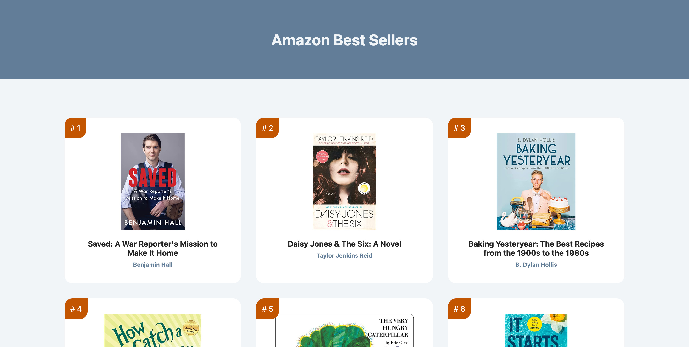
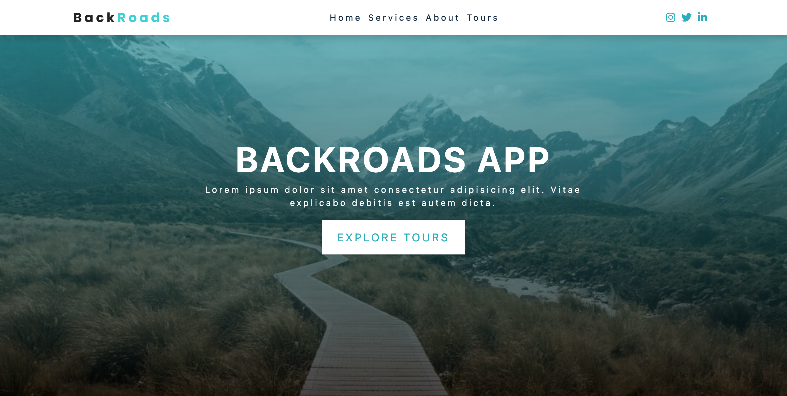
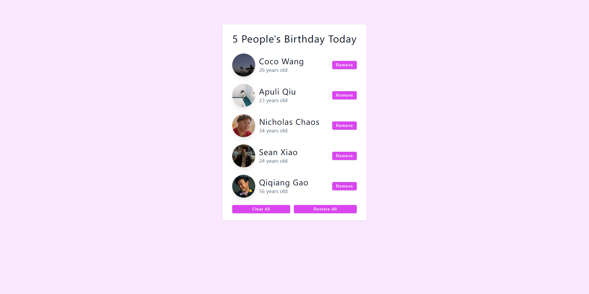

#  React.js Projects *from scratch*

- **Author:** Boyang Xiao (Sean)
- **Version:** React 18
- **Host:** Netlify

---

## Project #1

### Amazon Best Sellers Booklist

Overview:

- **Active site:** [Booklist: Best sellers](https://sean-react-booklist.netlify.app)
- **Repo:** [Project: Booklist](https://github.com/SeanXiaoby/react-learning-udemy/tree/main/2-my-booklist)

---

## Project #2

### Backroads Tour Company Homepage demo

Overview: 

- **Active site:** [Backroads App](https://sean-react-backroads.netlify.app/)
- **Repo:** [Project: Backroads-app](https://github.com/SeanXiaoby/react-learning-udemy/tree/main/3-backroads-app)

---

## Project #3

### Birthday list

Overview:

- **Active site:** [Birthday list: My buddies](https://sean-react-birthday-list.netlify.app/)
- **Repo:** [Project: Birthday List](https://github.com/SeanXiaoby/react-learning-udemy/tree/main/4-birthday-list)

---
